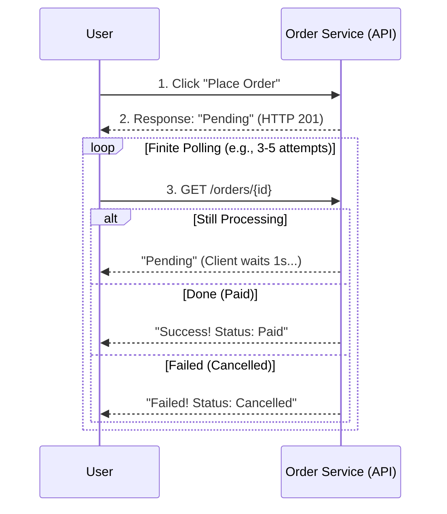
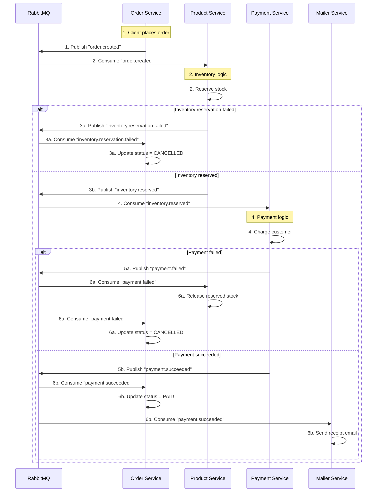

# Go Microservices E-Commerce (Practice Project)

This project is a **practice-only microservices backend** built with **Go**, **Gin**, **GORM**, and **Docker**.
It’s not for production use — it’s designed for learning how real systems are structured, communicate, and scale.

---

## Overview

Each service runs independently with its own routes, database models, and Swagger docs.
All services communicate through REST and RabbitMQ.

### Diagram 1: User's Placing Order



### Diagram 2: System Saga Logic


### Folder structure
```bash
D:.
├───auth-service
├───broker-service
├───cart-service
├───common
├───internal
├───logger-service
├───mailer-service
├───order-service
├───payment-service
└───product-service
```

### Key Features
*   **Event-Driven Architecture**: Uses RabbitMQ for asynchronous processing.
*   **Distributed Transactions (Saga Pattern)**: Ensures data consistency across services.
*   **Redis**: Accelerates product data retrieval.
*   **Resilient Messaging**: Broker automatically reconnects on network loss.
*   **Observability**: Centralized logging with Grafana Loki.
*   **CI/CD**: Automated build and test with GitHub Actions.

[Product service](product-service/README.md#product-service)  
[Cart service](cart-service/README.md#cart-service)  
[Order service](order-service/README.md#order-service)  
[Auth service](auth-service/README.md#auth-service)  
[Payment service](payment-service/README.md#payment-service)

---

### Current services

| Service | Port | Description |
|----------|------|-------------|
| **Product Service** | 8081 | Manages products and their CRUD operations |
| **Cart Service** | 8082 | Handles shopping cart creation, updates, and item management |
| **Order Service** | 8083 | Processes orders and connects with cart + user data |
| **Auth Service** | 8084 | Handles user registration, login, and JWT token generation |
| **Logger Service** | 8085 | Centralized logging service (gRPC/RabbitMQ consumer) |
| **Payment Service** | 8086 | Simulates payment processing |
| **Mailer Service** | - | Consumes events to send emails  |

### Infrastructure

| Service | Port | Description |
|----------|------|-------------|
| **PostgreSQL** | 5432 | Main database |
| **RabbitMQ** | 5672 | Message broker for async communication |
| **Redis** | 6379 | Caching layer |
| **MailHog** | 1025 | Email testing tool |
| **Jaeger** | 16686| Distributed Tracing UI |
| **Grafana** | 3000 | Dashboard |

---

### Tech stack

- **Language:** Go
- **Framework:** Gin
- **ORM:** GORM (PostgreSQL)
- **Docs:** Swagger (`swaggo/swag`)
- **Containerization:** Docker & Docker Compose
- **Live Reload:** Air
- **Authentication:** JWT
- **Messaging:** RabbitMQ
- **Caching:** Redis
- **Observability:** Grafana, Loki, Promtail
- **Tracing:** OpenTelemetry, Jaeger

---

### Setup

```bash
# Run all services
docker compose up --build

# Run individual service, example:
cd product-service
air

# Run the demo script to verify the entire flow:
./demo.ps1
```

Then visit Swagger UI for each service:

***Product***: http://localhost:8081/swagger/index.html  
***Cart***: http://localhost:8082/swagger/index.html  
***Order***: http://localhost:8083/swagger/index.html  
***Auth***: http://localhost:8084/swagger/index.html  
***Payment***: http://localhost:8086/swagger/index.html  


### Tools
*   **MailHog (Email Testing)**: http://localhost:8025
*   **Jaeger (Tracing UI)**: http://localhost:16686
*   **Grafana (Logs & Metrics)**: http://localhost:3000

### How to use
1. Open the Auth page then register and login to get the token.
2. On cart or order page click on the lock icon and type: **Bearer <"token">** remove the (", <>) symbol.

### Testing 
The `demo.ps1` script runs a full end-to-end verification of the Saga pattern. It executes 3 key scenarios:
1.  **Normal path**: A standard successful order. Verifies stock deduction and "Paid" status.
2.  **Out of stock**: Simulates an out-of-stock scenario. Verifies the order is "Cancelled" by the Saga flow.
3.  **Revert stock**: Simulates a mixed order (1 valid item, 1 invalid). Verifies the order is cancelled and the valid item's stock is rolled back.

**How to run:**
```powershell
./demo.ps1
```

### Load Testing
The project includes a custom load testing tool in `load-test/main.go`. It simulates concurrent users performing full purchase flows (Register -> Login -> Browse -> Add to Cart -> Checkout).

**Run the load test:**
```bash

# Reset stock for all products to 10,000 (always run this first when try this)
go run load-test/main.go -replenish

# Run with default settings (5 users and 30 seconds of doing thing)
go run load-test/main.go
```

## Author

**Thế Hoàng or you can call me *Josh*. Why? I just love that name and it shorter than my real name**  
CS Student | Backend Developer in training  
Learning Go, microservices, Java and JS.

# Vietnamese

## Xây dựng Microservices E-Commerce với Go

### Tổng quan

Mỗi service chạy độc lập, có route, model, và tài liệu Swagger riêng.
Tất cả giao tiếp với nhau qua REST và RabbitMQ.

### Về tính năng
*   **Kiến trúc hướng sự kiện**: Sử dụng RabbitMQ để xử lý bất đồng bộ.
*   **Giao dịch phân tán**: Đảm bảo tính nhất quán dữ liệu giữa các service.
*   **Cache**: Tăng tốc độ đọc dữ liệu sản phẩm.
*   **Resilient**: Broker tự động kết nối lại khi mất mạng, đảm bảo không mất tin nhắn.
*   **Giám sát (Observability)**: Ghi log tập trung với Grafana Loki.
*   **CI/CD**: Tự động build và test với GitHub Actions.


---

### Các service hiện có

| Service | Port | Mô tả |
|----------|------|-------|
| **Product Service** | 8081 | Quản lý sản phẩm |
| **Cart Service** | 8082 | Quản lý giỏ hàng |
| **Order Service** | 8083 | Xử lý đơn hàng |
| **Auth Service** | 8084 | Xử lý đăng ký, đăng nhập |
| **Logger Service** | 8085 | Ghi log |
| **Payment Service** | 8086 | Mô phỏng thanh toán |
| **Mailer Service** | - | Gửi email (Consumer) |

### Infrastructure

| Service | Port | Mô tả |
|----------|------|-------|
| **PostgreSQL** | 5432 | CSDL |
| **RabbitMQ** | 5672 | Message Broker |
| **Redis** | 6379 | Cache |
| **MailHog** | 1025 | Dùng để test email |
| **Jaeger** | 16686| Tracing UI |
| **Grafana** | 3000 | Dashboard Log/Metrics |

---

### Công nghệ sử dụng

- **Ngôn ngữ:** Go
- **Framework:** Gin
- **ORM:** GORM (PostgreSQL)
- **Docs:** Swagger (`swaggo/swag`)
- **Container:** Docker & Docker Compose
- **Live Reload:** Air
- **Xác thực:** JWT
- **Messaging:** RabbitMQ
- **Cache:** Redis
- **Giám sát:** Grafana, Loki, Promtail
- **Tracing:** OpenTelemetry, Jaeger

---

### Cách chạy

```bash
# Chạy tất cả service
docker compose up --build

# Chạy từng service riêng
cd auth-service
air
```


### Kiểm thử 
Script `demo.ps1` chạy kiểm thử E2E cho Saga với 3 kịch bản:
1.  **Đặt hàng thành công**: Đặt hàng thành công.
2.  **Hết hàng**: Hết hàng -> Hủy đơn.
3.  **Hoàn trả hàng**: Đơn hỗn hợp (1 hết hàng, 1 còn hàng) -> hoàn trả lại toàn bộ.

**Cách chạy:**
```powershell
./demo.ps1
```

### Mô phỏng chịu tải lớn
Công cụ load test nằm trong `load-test/main.go`.

**Cách chạy:**
```bash
# Reset kho hàng về 10,000
go run load-test/main.go -replenish

# Chạy mặc định (5 người dùng trong 30 giây)
go run load-test/main.go
```

Truy cập Swagger UI của từng service:
***Product***: http://localhost:8081/swagger/index.html  
***Cart***: http://localhost:8082/swagger/index.html  
***Order***: http://localhost:8083/swagger/index.html  
***Auth***: http://localhost:8084/swagger/index.html  
***Payment***: http://localhost:8086/swagger/index.html  
[Cách sử dụng](#how-to-use)

### Công cụ
*   **MailHog**: http://localhost:8025
*   **Jaeger**: http://localhost:16686
*   **Grafana**: http://localhost:3000